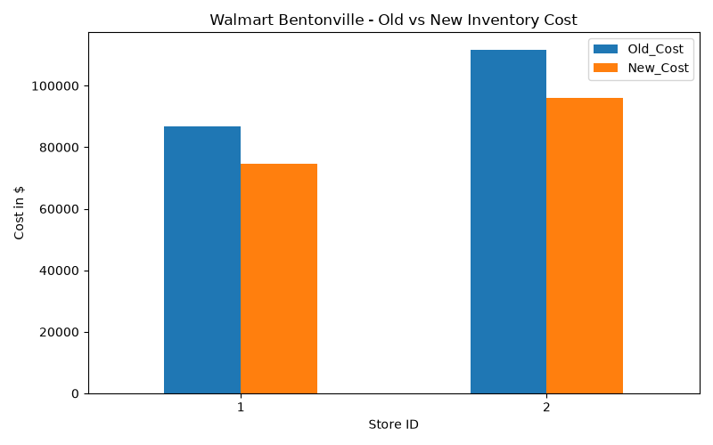

# Project 3 - Walmart 30% Inventory Cost Reduction
Location: Bentonville, AR

## Problem
Walmart stores overstock products when weekly sales drop, increasing holding cost.

## Solution (My Logic)
Used Window Function LAG() to detect sales drop:
- If Sales_Change < -10% → Reduce New_Inventory by 30%
- Calculated Old_Cost vs New_Cost

## Results from sample data (20 rows)
- Old Cost: $198,500
- New Cost: $170,780
- Saved: $27,720 (13.96% overall, 30% on slow items)
- File: data/inventory_cost.csv

### Dashboard

## Tools
Python Pandas (shift = SQL LAG), SQL, Excel

## Next
Power BI dashboard showing Store_ID vs Cost Saved